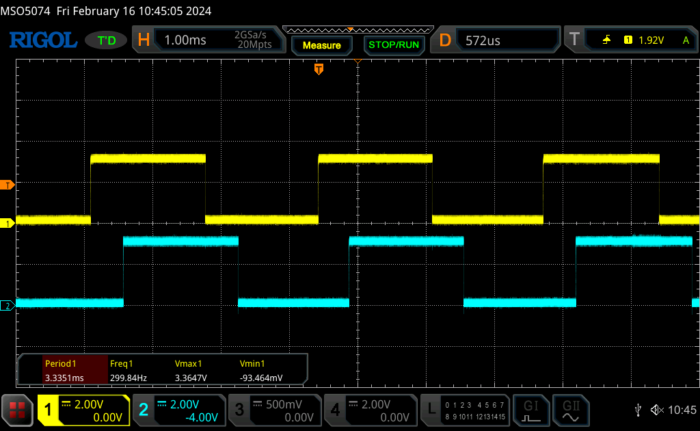
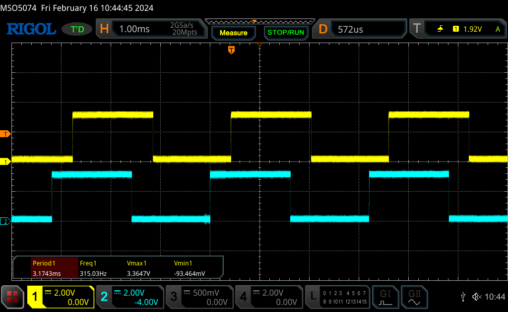

# RP2040-motor-encoder

Library for using a dc motor encoder utilizing RP2040 PIOs<br>
It was developed for JGA25-370 Motors with encoder.

## Description

This Library uses the built-in PIO State Machines to measure the direction and speed of a motor encoder.
It should work as long as the encoder has two outputs giving pulses.
The period is measured from rising edge to rising edge of the first pin.
The direction is measured by looking at the phase difference between both signals.

The first GPIO to be used can be chosen. the second GPIO has to be first_pin+1.

Direction 0:
<br>

Direction 1:
<br>

Encoders are normally giving more than one pulse per motor revolution. (in my case N=11)<br>
So for getting the frequency of the motor you calculate 1 / (period_us*N).

Note: If only one encoder is connected the period is still measured right. The second GPIO has to stay unconnected (or pulled to ground).

## Getting Started

### Dependencies

* cmake >= 3.12
* <a href="https://www.raspberrypi.com/documentation/microcontrollers/c_sdk.html">RP2040 C/C++ SDK</a>

### Building examples

Create build directory and configure project:
```
mkdir build && cd build && cmake .. && cd ..
```

Build:
```
cmake --build ./build --target all -- 
```

### Upload Executables

* Hold Bootsel while plugging in your Pico
* Drag the Executable "./build/example/MotorEncoderExample.uf2" to the "RPI-RP2" drive

Or (using picotool) run:
```
picotool load -F 'build/example/MotorEncoderExample.uf2' && picotool reboot
```

## Using Library

* Copy the MotorEncoder directory to your project path
* Include the subdirectory by adding the following to your CMakeLists.txt -> after project(...) setup
```
add_subdirectory(MotorEncoder)
```
* Link the MotorEncoder Library
```
target_link_libraries(MotorEncoderExample PUBLIC MotorEncoder)
```

## Version History

* 0.1
    * Initial Release

## License

This project is licensed under the BSD-3-Clause License - see the LICENSE.md file for details

## Acknowledgments

Inspired by:
* [pico-examples](https://github.com/raspberrypi/pico-examples)
* [Some_RPI-Pico_stuff](https://github.com/GitJer/Some_RPI-Pico_stuff/tree/main)